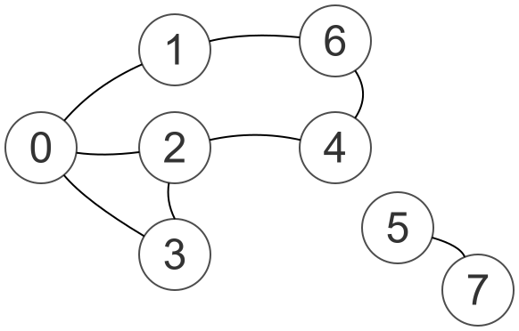

# Week 9 Assignment: Graphs, Reachability, and Stopping Early

## This Week in Class

### July 13 -- From an Array Bug to Circular Buffers

We opened by following up on a homework snag from week08: a stack's insertion logic was overwriting itself whenever the equivalent queue insertion code got adjusted nearby. That became the launching point for reviewing the array-shifting pitfall behind it -- shifting elements right (to make room at the front, the way a stack's `push` has to) with a left-to-right loop propagates a single value across the whole array instead of moving each value once. The fix is running that loop in reverse, from `size - 1` down to `0`.

We then compared time complexity: with a plain array, queue insertion is $\mathcal O(1)$ but removal is $\mathcal O(n)$; for a stack, both push and pop are $\mathcal O(n)$, since both require shifting. Linked lists get everything down to $\mathcal O(1)$, at the cost of the extra memory every node's pointers carry.

From there we reshaped the array conceptually into a circle, tracking two pointers -- front and back -- that advance with modulo arithmetic ($\text{position} + 1 \bmod \text{capacity}$) instead of shifting data. This gets a circular queue's insertion and removal down to $\mathcal O(1)$ while keeping an array's memory savings. Working out the circular *stack* version was left as homework.

**Further reading:**

* [The Python Tutorial -- Classes](https://docs.python.org/3/tutorial/classes.html) --
  background on instance methods and `self`, the mechanism behind
  `CircularBuffer`, `CircularStack`, and `CircularQueue` in
  [`circular.py`](./circular.py).

---

### July 14 -- Circular Stacks, Periodic Boundary Conditions, and Graphs

Picking up from the circular queue, we worked out the equivalent circular stack -- last in, first out -- tracking `front` and `back` pointers starting at the same position on an empty array. Because retreating a pointer can push its index below zero, we need a wraparound rule: position $-1$ should map back to the last valid index. Python already does this for list indexing (`list[-1]` is the last element), and `%` does the same for negative operands.

We connected this to *periodic boundary conditions*, a pattern that shows up in clocks, military time, and physics simulations of crystal lattices: reaching the end of a finite structure loops back to the start. For an array of length 4, any index modulo 4 always lands in $\{0, 1, 2, 3\}$ -- exactly how a circular buffer stays valid no matter how far the index climbs. We practiced deriving this live, since a technical interview cares more about sound reasoning than a memorized formula.

We then introduced graphs with a plain-English question about a small town map: can you get from town A to town H? Points are *vertices*, connecting roads are *edges*, and asking whether one vertex can reach another is the *reachability problem* -- foundational to networking, logistics, and social-network analysis. We translated a hand-drawn map into Python as a list of lists -- the *adjacency list* representation, where each vertex's direct neighbors are stored as their own list.

**Further reading:**

* [The Python Tutorial -- Classes](https://docs.python.org/3/tutorial/classes.html) --
  background on `self` and instance methods, relevant to
  [`circular.py`](./circular.py)'s `CircularStack`.

---

### July 15 -- Adjacency Matrices and Reachability

We reviewed the adjacency list representation: for every vertex, list only its *direct* neighbors, not everything it reaches indirectly. Since letters run out quickly once a graph has many vertices, vertices are labeled with integers starting at 0. We also discussed why a "multi-node" -- a node object holding an arbitrary, growable list of pointers to other nodes -- would work but waste memory, since every added connection grows that node's own list of pointers.

We then converted the same graph into an *adjacency matrix*: an $n \times n$ array where a 1 at row $i$, column $j$ marks an edge between vertices $i$ and $j$, and 0 marks its absence. Because our edges are undirected, the matrix is symmetric, and the main diagonal is always 0, since a vertex never connects to itself. [`graphs.py`](./graphs.py)'s `produce_adjacency_matrix` builds this matrix from an adjacency list, and we confirmed its printed output against a hand-drawn matrix, row by row.

Finally, using the analogy of always turning the same direction to find a way out of a maze, we wrote a loop with a `visited` list and a list of vertices still to explore to determine whether one vertex is reachable from another, starting from vertex 0. We traced the algorithm by hand and confirmed vertex 6 is reachable, while vertices 5 and 7 are not reachable from that starting point -- they only reach each other. That traced-by-hand version is `naive_reachability` in [`graphs.py`](./graphs.py): it is correct, but it always finishes visiting every reachable vertex before it ever checks whether the target was among them. Our assignment for this week is to fix exactly that.

**Further reading:**

* [More on Lists](https://docs.python.org/3/tutorial/datastructures.html#more-on-lists) --
  covers `list.append` and other list operations `naive_reachability`
  and `better_reachability` are built out of.

---

## Overview

Our discussion was based on the following simple graph, with 8 vertices (aka, points, aka nodes).



A full treatment on graphs is beyond the scope of COMP 271. Just for reference, the graph above is an undirected graph with two components.

File [`graphs.py`](./graphs.py) already contains the adjacency list representation of the graph above, along with the following artifacts that should not be changed.

* `AdjacencyList` and `AdjacencyMatrix` -- type aliases for `list[list[int]]`, so the rest of the file can say what a list of lists *means* instead of just what it *is*.
* `graph` -- the 8-vertex adjacency list for the graph above.
* `produce_adjacency_matrix` and `display_adjacency_matrix` -- convert an adjacency list to a matrix, and print it neatly.
* `naive_reachability(graph, start, target) -> bool` -- the hand-traced algorithm from July 15. Correct, but repetitive and therefore not very efficient.

Your job is one function: `better_reachability`, currently a stub marked `pass`. Do not modify `naive_reachability` -- it stays in the file as the baseline your function has to match.

---

## Part 1: `better_reachability`

`naive_reachability`'s `while` loop keeps going only as long as `explore_next` is non-empty. That single condition has no way to notice that the answer to the whole function might already be settled -- it only stops once there is nothing left to look at, whether or not `target` showed up three iterations ago.

**A note on how `explore_next` behaves in `naive_reachability`.**

Every vertex is added at the back with `.append(neighbor)`, and every removal happens at the front with `explore_next.pop(0)`. Adding at one end and removing from the other is FIFO staging, so `explore_next` is functioning as a queue, even though it is only ever a plain list. This is a little confusing on the removal side: Python spells removal `pop()` no matter which end you use it on, which is the exact same method name week08's `Stack.pop()` uses for a genuinely LIFO removal. `explore_next.pop(0)` and `Stack.pop()` share a name, not a meaning -- only the index passed in (`0` versus none at all) tells you which behavior you are actually getting.

A plain list can just as easily be made to behave like a stack instead of a queue: `explore_next.insert(0, neighbor)` to add at the front, paired with that same `explore_next.pop(0)` to remove from the front, would make `explore_next` LIFO -- the last vertex inserted at the front is the first one popped back off it. Both operations shift every other element to make room, so unlike the $\mathcal O(1)$ `append()`/`pop()` pair a stack normally uses at the back of a list, this front-only version costs $\mathcal O(n)$ either way.

**Contract:**

* Same signature as `naive_reachability`: `better_reachability(graph: AdjacencyList, start: int, target: int) -> bool`.
* Same return value as `naive_reachability`, for every `graph`, `start`, and `target` -- the two functions must never disagree.
* Must be able to end the `while` loop the moment the answer is known, instead of only when `explore_next` empties out on its own.
* `start == target` returns `True` without needing to look at any neighbors.

**No `break` statements.** Control the loop through its condition, the same way every other loop in this repo does -- adding a `break` would dodge the actual question this assignment is asking.

**Something to think about, not to look up:** what second question could the `while` loop's condition ask, alongside "is `explore_next` still non-empty," so that the loop is willing to stop the instant the answer is known? What is the smallest new piece of state you would need -- created before the loop starts, changed in exactly one place inside it -- to make that second question answerable?

A note on "shorter time": these are small, hand-built graphs, and a stopwatch won't show a meaningful difference on them. "Shorter" here means fewer iterations in the worst case -- specifically, not continuing to explore after the target has already been found -- not a wall-clock benchmark.

**One return statement.** Your method must have exactly one `return`, at the very end.

---

## Part 2: Reflection -- Comparing Your Week 8 Work with the Solutions

This part has no new code to write. Open your week 8 submission alongside [`../week08/week08-solutions.py`](../week08/week08-solutions.py) and compare what you wrote with what the solutions contain. Write your answers as comments at the very bottom of [`graphs.py`](./graphs.py), beneath `better_reachability` and `main`, so they are included when you submit. A few sentences per question is enough.

```python
# Part 2 Reflection
#
# 1. BoundedCollection._add in the solution computes its return value in
#    one line -- `added = not self.is_full()` -- and then uses that same
#    variable both to guard whether any shifting happens AND as the
#    value returned at the end. Did your week 8 _add do the same, or did
#    you write something closer to two separate returns guarded by an
#    if/else (`if self.is_full(): return False` ... `return True`)? If
#    you used two returns, how would you fold them into the solution's
#    single-variable approach?
#
# 2. The solution's shifting loop inside _add runs backwards --
#    `for i in range(last, index, -1)` -- exactly the reverse-loop fix
#    from the July 13 class discussion. Did your week 8 _add's
#    right-shift loop run in this same direction from the start, or did
#    you first write a left-to-right version that propagated one value
#    across the array, and have to debug your way to the reversed loop?
#
# 3. Stack.push and Queue.enqueue in the solution both call the exact
#    same _add, differing only in the index argument (0 vs.
#    self.size()); Stack.pop and Queue.dequeue both call the exact same
#    _remove(), with no argument at all. Did your push/pop/enqueue/
#    dequeue only ever call _add and _remove, or did any of them
#    re-implement a shifting loop directly inside Stack or Queue --
#    duplicating logic that _add or _remove already provided?
```

---

## Verification

After implementing `better_reachability`, run [`graphs.py`](./graphs.py) from the `week09` directory:

```
python3 graphs.py
```

Check your output against the expected values:

```
    0    1    1    1    0    0    0    0
    1    0    0    0    0    0    1    0
    1    0    0    1    1    0    0    0
    1    0    1    0    0    0    0    0
    0    0    1    0    0    0    1    0
    0    0    0    0    0    0    0    1
    0    1    0    0    1    0    0    0
    0    0    0    0    0    1    0    0
True
False
False
True
False
False
```

The matrix is `display_adjacency_matrix`'s output, unchanged from before this assignment. The first three booleans are `naive_reachability` checking whether vertex 6, then 5, then 7, is reachable from vertex 0. The last three booleans are `better_reachability` answering the exact same three questions -- and must match the first three, one for one.

Edge cases to verify manually:

* `better_reachability(graph, 0, 0)` -- `start` equal to `target` -- returns `True` immediately.
* `better_reachability(graph, 5, 7)` -- both vertices exist only in their own small, disconnected component -- returns `True`.
* `better_reachability(graph, 7, 0)` -- reachable in the opposite direction of a connected pair the sample calls do not test -- should agree with `naive_reachability(graph, 7, 0)`.
* `better_reachability(graph, 7, 11)` -- well?

---

## Further reading

* [The Python Tutorial -- Classes](https://docs.python.org/3/tutorial/classes.html) --
  covers how instance methods and `self` work, background for
  `CircularStack` and `CircularQueue` in [`circular.py`](./circular.py).

* [More on Lists](https://docs.python.org/3/tutorial/datastructures.html#more-on-lists) --
  covers the list operations `naive_reachability` and
  `better_reachability` are built out of.

---

## How to Submit

Upload your work on **Sakai** under the assignment for **Week 09**.

Submit only your Python file:

```
graphs.py
```

No screenshots, no PDFs, no other file types -- Python files only. Confirm with `ls` that the file exists before you upload.

---

## How Your Work Is Evaluated

**Submission credit.** Submitting an assignment earns you 1 point; not submitting earns 0. This is not a score for quality -- it simply records that you completed the work on time.

**No late work, no extensions.** We discuss solutions in class immediately after the deadline, and solutions are posted at the same time. Because the answers are public from that moment on, late submissions cannot be accepted and deadlines cannot be extended.

**Self-evaluation.** After solutions are posted, you evaluate your own work. Using the posted solutions and Leo's written instructions as a guide, you decide what you understood, what you got wrong, and what you need to practice to avoid the same mistakes in the future. Making mistakes is how learning happens. Not repeating them is the evidence that it did.
